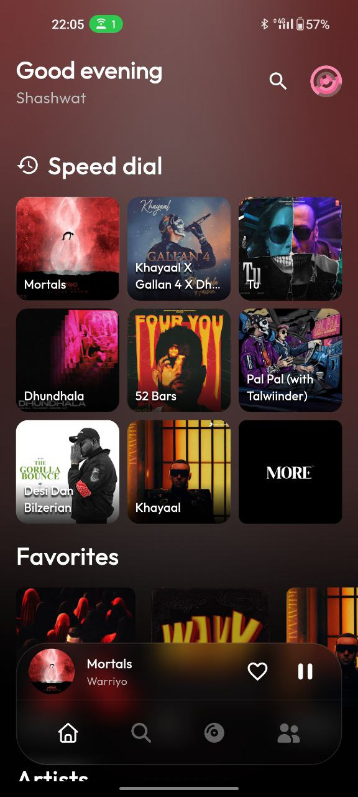
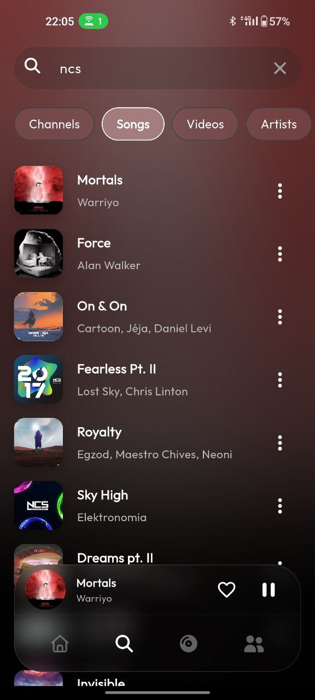
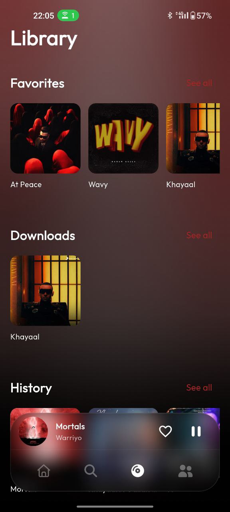
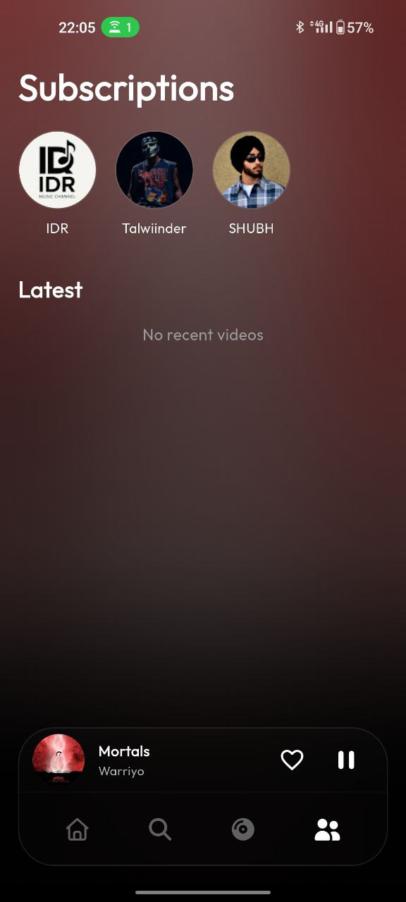
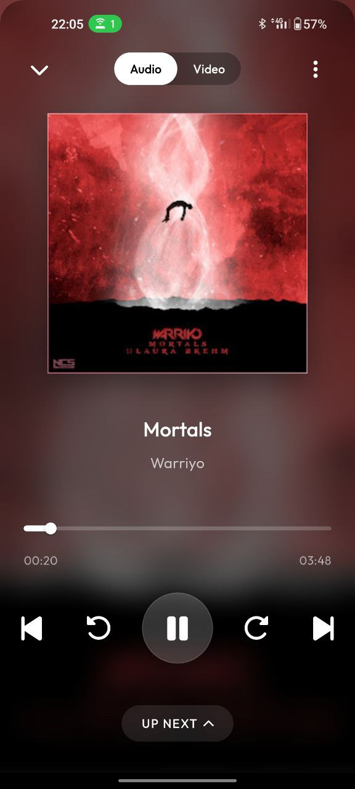

# YTX - Advanced YouTube Music Client

<p align="center">
  
</p>

YTX is a feature-rich, privacy-focused YouTube Music client built with Flutter. It offers a premium ad-free experience with background playback, offline downloads, and a modern, customizable UI.

## 🚀 Features

*   **Ad-Free Streaming**: Enjoy music without interruptions.
*   **Background Playback**: Keep listening while using other apps or with the screen off.
*   **Offline Downloads**: Download songs and videos for offline listening.
*   **Share to Play**: Share links directly from YouTube or YouTube Music to YTX to play them instantly.
*   **Auto-Queue**: Automatically queues related songs for endless playback.
*   **Dynamic Theming**: UI adapts to the colors of the currently playing album art.
*   **RapidAPI Fallback**: (Failure is very rare) User-configurable fallback system using RapidAPI to ensure playback reliability even if the primary API fails.
*   **Sleek UI**: Modern, glassmorphic design with smooth animations.
*   **Privacy Focused**: No login required, data stored locally.

## 📸 Screenshots

<p align="center">
  
  
  
  
  
</p>

## 🛠️ Tech Stack

*   **Framework**: [Flutter](https://flutter.dev/)
*   **State Management**: [Riverpod](https://riverpod.dev/)
*   **Audio Engine**: [Just Audio](https://pub.dev/packages/just_audio) & [Audio Service](https://pub.dev/packages/audio_service)
*   **Local Storage**: [Hive](https://docs.hivedb.dev/)
*   **Networking**: [Dio](https://pub.dev/packages/dio) & [Http](https://pub.dev/packages/http)
*   **API**: Custom YouTube Internal API & RapidAPI (Fallback)

## ⚙️ Setup & Installation

### Prerequisites

*   Flutter SDK (Latest Stable)
*   Dart SDK
*   Android Studio / VS Code
*   Java JDK 11 or 17

### Installation

1.  **Clone the repository**:
    ```bash
    git clone https://github.com/Shashwat-CODING/YTX.git
    cd YTX
    ```

2.  **Install dependencies**:
    ```bash
    flutter pub get
    ```

3.  **Run the app**:
    ```bash
    flutter run
    ```

4.  **Build Release APK**:
    ```bash
    flutter build apk --release
    ```

## 🤝 Contributing

Contributions are welcome! Whether it's reporting a bug, suggesting a feature, or writing code, we appreciate your help.

### How to Contribute

1.  **Fork the Project**
2.  **Create your Feature Branch** (`git checkout -b feature/AmazingFeature`)
3.  **Commit your Changes** (`git commit -m 'Add some AmazingFeature'`)
4.  **Push to the Branch** (`git push origin feature/AmazingFeature`)
5.  **Open a Pull Request**

### Development Guidelines

*   Follow the existing code style.
*   Use `flutter analyze` to check for linting errors.
*   Ensure new features are tested.

## 📝 License

Distributed under the MIT License. See `LICENSE` for more information.

---

<p align="center">
  Built with ❤️ by Shashwat
</p>
